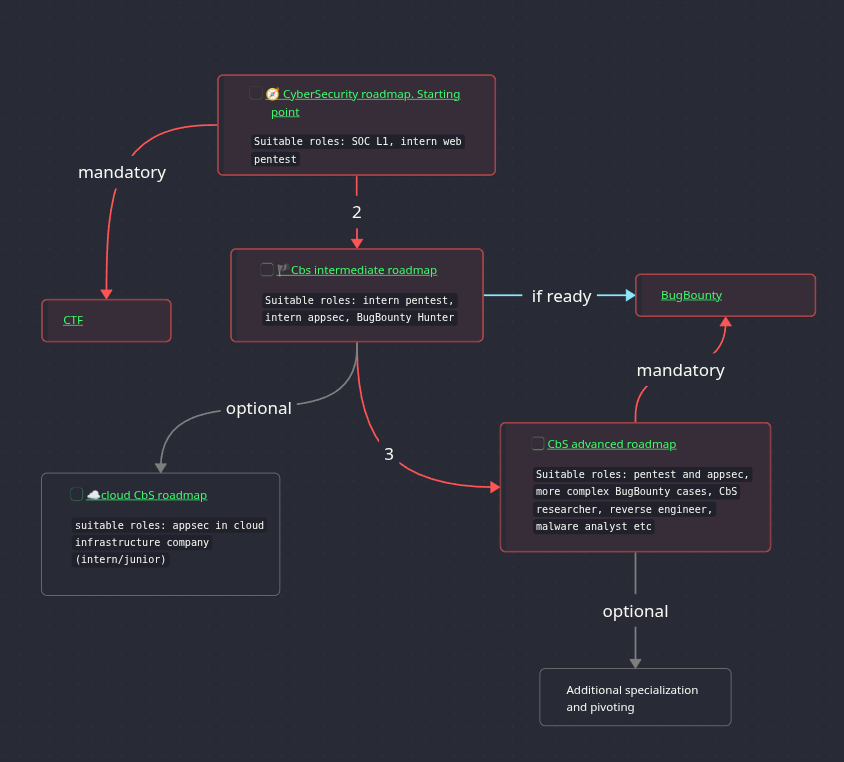

# Practical offensive security roadmap
  Series of Cybersecurity roadmaps for those who want to learn offensive security. The roadmaps are intended to be viewed in Obsidian. Just clone repo in Obsidian vault and open "Starting point". This roadmap is intended primarily as foundation for offensive security, contains most important things to help you get started, start participating in CTFs etc. Only **Free** labs are included in all roadmaps.

# Suggested Order: 

